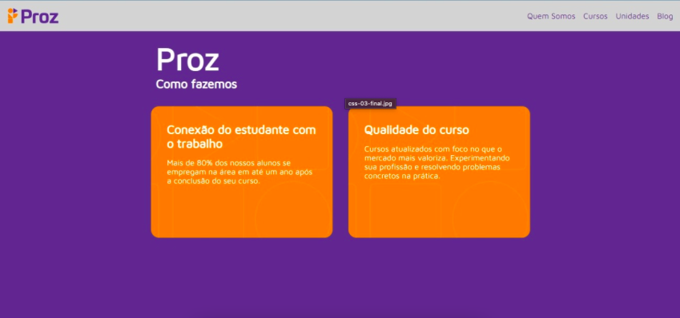

# desafios-da-proz
atividades da proz usando algumas linguagens

## atividade 1
**Descrição:** Crie o corpo de uma página sobre lugares turísticos na Europa. Nela, você deve focar apenas no conteúdo da página, adicionando textos, cards, imagens, entre outros.

**Limitações:** Construa apenas o html.

*Fontes:*
- [Site sobre pontos turisticos na europa](https://turismo.eurodicas.com.br/pontos-turisticos-na-europa/)
- [Imagem do mural da página inicial](https://www.google.com/url?sa=i&url=https%3A%2F%2Fbr.freepik.com%2Ffotos-vetores-gratis%2Faviao-ceu&psig=AOvVaw3q4vXQRBYjPeOD6RuSu16I&ust=1709565411543000&source=images&cd=vfe&opi=89978449&ved=0CBIQjRxqFwoTCPj5lcqx2IQDFQAAAAAdAAAAABAE)
- [mapa da Europa](https://mundoeducacao.uol.com.br/geografia/o-continente-europeu.htm)


## desafio 1
Usando a linguagem de marcação para concluir algumas atividades, como:
- estruturar o conteúdo por TAGs
- usar o ancora para ir para outra página html
- uso de tags h1 - h6, p, ul e li para listas, header para o cabeçalho do body, section, main e footer.

## atividade 2
A cidade do Recife é uma das mais famosas do Nordeste, ela possui diversos pontos turísticos e um deles é o Marco Zero. Sabendo disso, crie uma página HTML, falando sobre esse ponto turístico de acordo com os seguintes pré-requisitos: 

1. A página precisa ter cabeçalho, conteúdo e rodapé;
2. A página precisa ter imagens; 
3. Use a tag de semântica textual inline.

*fontes:*
- [www.viajali.com.br - imagens e conteúdos](https://www.viajali.com.br/marco-zero-recife/)

## atividade 3
Usando a mesma página criada na atividade anterior, criar duas novas páginas html com cada uma falando sobre outros pontos turísticos de Recife Antigo. As páginas devem contém um link que leva o usuário às demais páginas.
*fontes:*
- [www.viajali.com.br - imagens e conteúdos](https://www.viajali.com.br/recife-antigo/#:~:text=Recife%20antigo%3A%20o%20que%20fazer%201%201.%20Pra%C3%A7a,Olinda%20Andr%C3%A9%20Luiz%20Lopes%20Vieira%20...%20Mais%20itens)

## desafio 2
Introdução ao CSS:
- Criar um formulário simples com nome, email, telefone e senha.
- Linkar o file do CSS no HTML a usar algumas propriedades.

Sobre o CSS:
- O id tem maior prioridade que class;
- O código mais ao final do arquivo tem maior prioridade que os primeiros. Por exemplo, a cor seria "aqua" ao usar este código a seguir (se trocar a posição você perceberá que quanto o código mais abaixo é que irá ser mantido, seguindo o mesmo sentido de linguagens de programação - o ultimo valor instanciado é quem permanecerá, mas isto pode não funcionar quando está configurando o display de um grupo de elementos.):
```CSS
#ultima-caixa {
    border-color: blueviolet;
}

#ultima-caixa {
    border-color: aqua;
}
```
- Para estilizar uma tag usando um ID como referência, precisará colocar o "#" na frente. Se for referenciar um class terá que usar um ".".

## desafio 3

Fazer o html ficar semelhante ao da imagem seguindo as limitações propostas pelo tutor.


## atividade 4

Construir um estilo paras as três páginas implementados (da atividade 3).

## atividade 5

Brincar com o joguinho FLEXBOX FROGGY [link](https://flexboxfroggy.com/) e colocar seu código no vscode.

## prática guiada 1

Estilizar o html já criado pela plataforma, de acordo com o que foi pedido.
- **Desafio:** - aplicar a responsividade.